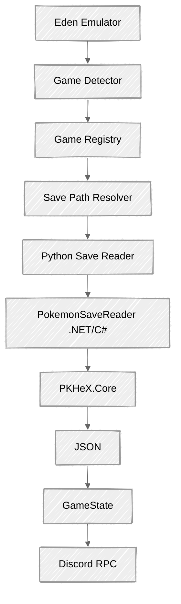

# Pokémon Switch RPC

> Discord Rich Presence for Pokémon games running through the Eden
> emulator.

Pokémon Switch RPC is a modular Discord Rich Presence application that
detects Pokémon games running through the **Eden Nintendo Switch
emulator** and reads supported local save data through **PKHeX.Core**.

The application is designed to expose useful, verified game state
through Discord without modifying save files.

## ✨ Features

-   🎮 Automatically detect Pokémon games running through Eden
-   🎯 Identify the currently running game from the Eden window
-   💬 Discord Rich Presence integration
-   ⏱️ Session timer in Rich Presence
-   💾 Read Pokémon save data through PKHeX.Core
-   📖 Read Pokédex progress from supported save files
-   🕐 Read save playtime
-   👤 Read trainer information
-   🧩 Read party and box Pokémon
-   📍 Read location data for supported save formats
-   🔒 Read-only save access --- save files are never modified
-   ⚙️ JSON-based configuration
-   🔌 Modular architecture for additional Pokémon games

## 🎮 Supported Games

Detection and save-reader support are tracked independently.

| Game | Eden Detection | Save Reader | Pokédex | Playtime |
|---|:---:|:---:|:---:|:---:|
| Pokémon Legends: Arceus | ✅ | ✅ | ✅ | ✅ |
| Pokémon Scarlet | ✅ | ✅ | ✅ | ✅ |
| Pokémon Violet | 🚧 | 🚧 | 🚧 | 🚧 |
| Pokémon Legends: Z-A | 🚧 | 🚧 | 🚧 | 🚧 |        🚧         🚧

Current verification means the save reader has been tested against an
actual supported local save. Detection alone does not mean that a game
is fully supported.

## 🏗️ Architecture

The runtime architecture is:



The project intentionally separates game detection, save parsing, common
state, and Discord presentation.

## 📁 Project Structure

``` text
pokemon-switch-rpc/
├── main.py
├── dev.py                         # Developer CLI
├── config.json
├── pyproject.toml
├── requirements.txt
├── requirements-dev.txt
├── CHANGELOG.md
├── CONTRIBUTING.md
├── LICENSE
├── .gitignore
│
├── assets/
│
├── games/
│   ├── base.py
│   ├── registry.py
│   ├── state.py
│   ├── state_formatter.py
│   ├── state_parser.py
│   ├── detector.py
│   ├── save_paths.py
│   ├── save_reader.py
│   └── game_save_reader.py
│
├── rpc/
│   └── discord_rpc.py
│
├── test/
│   ├── test_dev.py                # Automated pytest tests
│   ├── game_detection.py
│   ├── save_path.py
│   ├── game_save_reader.py
│   ├── command_line.py
│   └── windows.py
│
├── bridge/
│   ├── PKHeX/                     # Local, ignored by Git
│   └── PokemonSaveReader/
│
└── docs/
    ├── ARCHITECTURE.md
    ├── DEVELOPMENT.md
    ├── CONFIGURATION.md
    ├── SAVE-READER.md
    ├── DISCORD-RPC.md
    ├── GAME-SUPPORT.md
    ├── TROUBLESHOOTING.md
    ├── PKHeX.md
    └── ROADMAP.md
```

## 🔧 Requirements

### Software

-   Windows 11
-   Python 3.12+
-   .NET SDK 10+
-   Discord desktop application
-   Eden emulator
-   A supported Pokémon game

### Runtime Python Dependencies

Defined in `requirements.txt`:

``` text
pypresence
psutil
pywin32
```

Install with:

``` powershell
pip install -r requirements.txt
```

### Development Dependencies

Defined in `requirements-dev.txt`:

``` text
ruff
pyright
pytest
```

Install with:

``` powershell
pip install -r requirements-dev.txt
```

Development tooling is configured in `pyproject.toml`.

## 🚀 Installation

### 1. Clone the repository

``` powershell
git clone https://github.com/ramadhafidz/emulator-switch-discordrpc.git pokemon-switch-rpc
cd pokemon-switch-rpc
```

### 2. Create a Python virtual environment

``` powershell
python -m venv .venv
.\.venv\Scripts\Activate.ps1
```

### 3. Install dependencies

For running the application:

``` powershell
pip install -r requirements.txt
```

For development:

``` powershell
pip install -r requirements-dev.txt
```

### 4. Set up PKHeX.Core

This project uses **PKHeX.Core** as an external dependency for Pokémon
save parsing.

PKHeX source is intentionally **not included in this repository**.

Expected local structure:

``` text
pokemon-switch-rpc/
└── bridge/
    ├── PKHeX/
    │   └── PKHeX.Core/
    │
    └── PokemonSaveReader/
        ├── PokemonSaveReader.csproj
        └── Program.cs
```

Obtain PKHeX separately and place its source at:

``` text
bridge/PKHeX/
```

Do not commit `bridge/PKHeX/`.

### 5. Build the save reader bridge

Restore:

``` powershell
dotnet restore bridge/PokemonSaveReader/PokemonSaveReader.csproj --ignore-failed-sources
```

Build:

``` powershell
dotnet build bridge/PokemonSaveReader/PokemonSaveReader.csproj --no-restore
```

### 6. Configure Discord

Create a Discord application and obtain its Application ID.

Configure the ID in `config.json`:

``` json
{
    "discord": {
        "client_id": "YOUR_DISCORD_APPLICATION_ID",
        "save_refresh_interval": 15,
        "pokedex_rotation_interval": 5
    }
}
```

See `docs/CONFIGURATION.md` for configuration details.

## ▶️ Usage

Start Discord first, then launch Eden and a supported Pokémon game.

Run:

``` powershell
python main.py
```

The application will:

1.  Detect the Eden process.
2.  Detect the currently running Pokémon game.
3.  Locate the game's save file.
4.  Read supported save data.
5.  Build the current `GameState`.
6.  Update Discord Rich Presence.
7.  Clear Rich Presence when the game closes.

The session timer remains active while the current game session is
represented in Discord.

## 🧪 Development Workflow

The current development quality checks are:

``` powershell
ruff check --fix .
ruff format .
pyright
pytest
```

The `dev.py` CLI provides shorter commands:

``` powershell
python dev.py check
python dev.py format
python dev.py lint
python dev.py typecheck
python dev.py test
python dev.py build
python dev.py run
python dev.py save
python dev.py clean
python dev.py all
```

The CLI preserves subprocess exit codes and runs from the repository root.
Use `python dev.py --help` to list available commands.

## 💾 Save Data

Save files are accessed in read-only mode.

The project does not:

-   Modify save files.
-   Write Pokémon data.
-   Inject data into the game.
-   Bypass Nintendo online services.
-   Modify emulator security mechanisms.
-   Upload save data to external services.

Save parsing is performed locally through PKHeX.Core.

The project intentionally avoids manually guessing save offsets.
Game-specific structures must be based on verified PKHeX implementations
or other reliable technical information.

## 🧩 Save Reader

The C# bridge identifies supported save formats through PKHeX:

``` text
SaveUtil.GetSaveFile()
        │
        ├── SAV8LA
        │     └── Pokémon Legends: Arceus
        │
        └── SAV9SV
              └── Pokémon Scarlet / Violet
```

The bridge converts save data into a common JSON structure.

For Scarlet/Violet, the current reader exposes data including:

``` text
Game
Trainer
Playtime
Pokédex
Party
Boxes
Location
```

Example location data:

``` json
{
    "name": "Artazon",
    "fieldID": 0,
    "locationID": 86,
    "x": 3709.828369140625,
    "y": 154.77886962890625,
    "z": -1743.365966796875
}
```

The human-readable location name is resolved using PKHeX's game
string/location data rather than a project-specific hardcoded location
dictionary.

## ⚙️ Configuration

Game-specific Rich Presence settings are stored in `config.json`.

Example:

``` json
{
    "discord": {
        "client_id": "YOUR_DISCORD_APPLICATION_ID",
        "save_refresh_interval": 15,
        "pokedex_rotation_interval": 5
    },
    "games": {
        "pokemon_scarlet": {
            "name": "Pokémon Scarlet",
            "region": "Paldea",
            "large_image": "scarlet",
            "large_text": "Pokémon Scarlet"
        }
    }
}
```

Each game can define:

-   Display name.
-   Region.
-   Discord artwork.
-   Artwork tooltip.

Update intervals are configurable in the `discord` section.

## 🧪 Testing

Automated tests are run with:

``` powershell
pytest
```

Initial pytest coverage is in `test/test_dev.py`, targeting the
developer CLI.

Current manual/integration test scripts:

### Game detection

``` powershell
python test/game_detection.py
```

### Save path resolution

``` powershell
python test/save_path.py
```

### Game save reader

``` powershell
python test/game_save_reader.py
```

### Eden process inspection

``` powershell
python test/command_line.py
python test/windows.py
```

The save reader test currently exercises the local C# bridge and
supported local saves.

The project is building out pytest-based automated tests alongside
existing manual integration scripts.

The C# bridge can also be tested directly:

``` powershell
dotnet run --project bridge/PokemonSaveReader -- "<path-to-save>"
```

Do not commit real save files to the repository.

## 🗺️ Roadmap

The detailed roadmap is maintained in:

``` text
docs/ROADMAP.md
```

Current high-level progression:

``` text
Foundation                         ✅
Eden Detection                    ✅
Architecture                      ✅
PKHeX Save Bridge                 ✅
Python Code Quality               ✅
Documentation Sync                🔄
Developer CLI                     ✅
Automated Testing                 ⏳
Dynamic Rich Presence             ⏳
Additional Game Support           ⏳
Packaging / Release               ⏳
```

See `docs/ROADMAP.md` for the detailed milestone breakdown.

## 📚 Documentation

-   [Architecture](docs/ARCHITECTURE.md)
-   [Development Setup](docs/DEVELOPMENT.md)
-   [Configuration](docs/CONFIGURATION.md)
-   [Save Reader](docs/SAVE-READER.md)
-   [Game Support](docs/GAME-SUPPORT.md)
-   [Discord RPC](docs/DISCORD-RPC.md)
-   [Troubleshooting](docs/TROUBLESHOOTING.md)
-   [PKHeX](docs/PKHeX.md)
-   [Roadmap](docs/ROADMAP.md)

Documentation should reflect the actual implementation status. Planned
features should not be presented as completed.

## 🤝 Contributing

Contributions, bug reports, and suggestions are welcome.

Before contributing:

-   Use verified save structure information.
-   Do not guess offsets.
-   Keep save access read-only.
-   Keep game-specific logic modular.
-   Avoid user-specific absolute paths.
-   Do not commit emulator save files.
-   Do not commit third-party PKHeX source.
-   Run Ruff and Pyright before committing.
-   Run relevant tests for changed functionality.

See `CONTRIBUTING.md` if present.

## ⚖️ Third-Party Software

### PKHeX

PKHeX is used for Pokémon save file parsing.

PKHeX is developed by the PKHeX contributors and is licensed under the
GNU General Public License v3.0.

PKHeX source is not included in this repository and must be obtained
separately.

### PyPresence

Used for Discord Rich Presence communication.

See the PyPresence project for its license and terms.

### Eden Emulator

Used as the Nintendo Switch emulator whose process and window are
detected by this application.

This project is not affiliated with or endorsed by Eden or The Pokémon
Company.

## ⚠️ Disclaimer

Pokémon and related names, characters, and assets are trademarks of
their respective owners.

This project is a fan-made, independent software project and is not
affiliated with, endorsed by, or sponsored by:

-   Nintendo
-   The Pokémon Company
-   Game Freak
-   Eden

Use of this project is at your own discretion.

## 📄 License

The licensing terms for this project are currently being determined.

Third-party dependencies retain their respective licenses.
